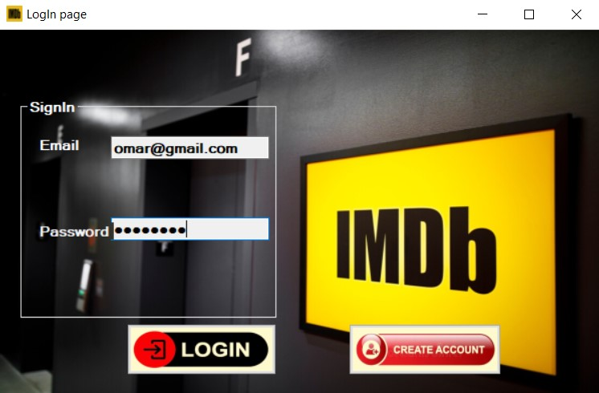
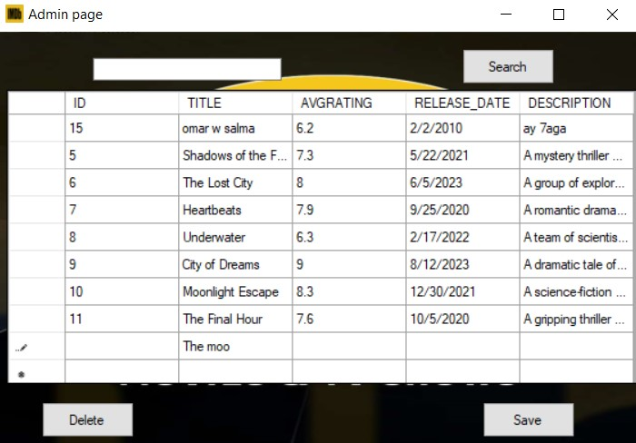
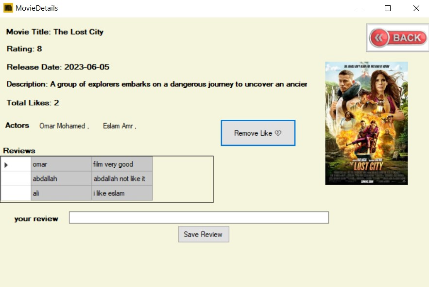
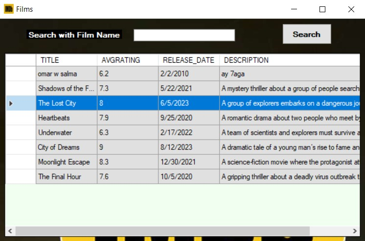
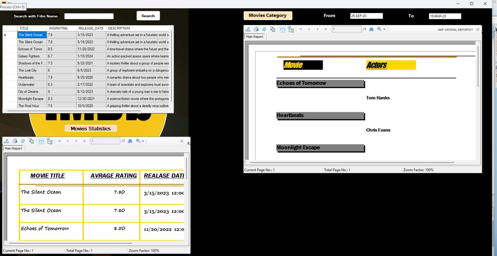

# IMDb_Movies_System 🎬🎦

This project is a web-based application that allows users to browse, rate, and review movies and TV shows. It features account registration, search functionality, and user-generated content such as ratings and reviews. Administrators have enhanced privileges to manage content and users. The system is designed to be scalable, intuitive, and community-driven, helping users discover and evaluate media through shared opinions and aggregated ratings.

## 🛠️ Technologies Used

- **Programming Language:** C#
- **Framework:** .NET Framework
- **Database:** Oracle Database
- **Design Principles:**
   
  - SOLID principles  
  - Object-Oriented Programming (OOP)  
  - Clean Code practices

## 📸Screenshots

